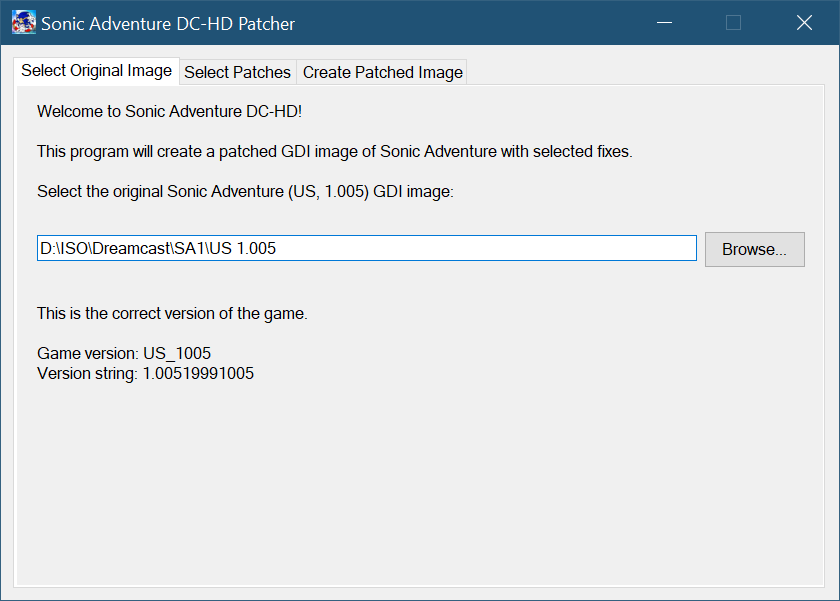
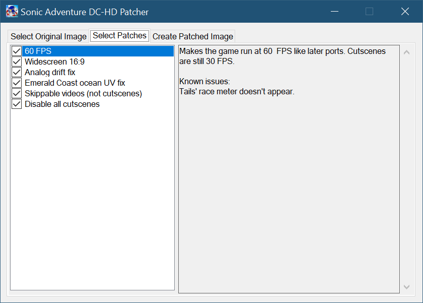
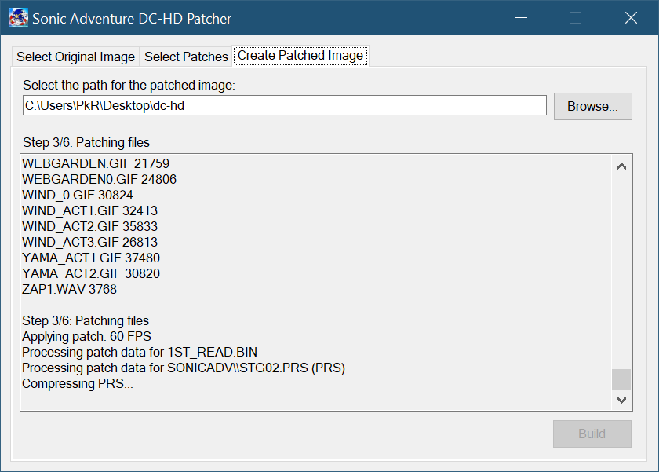
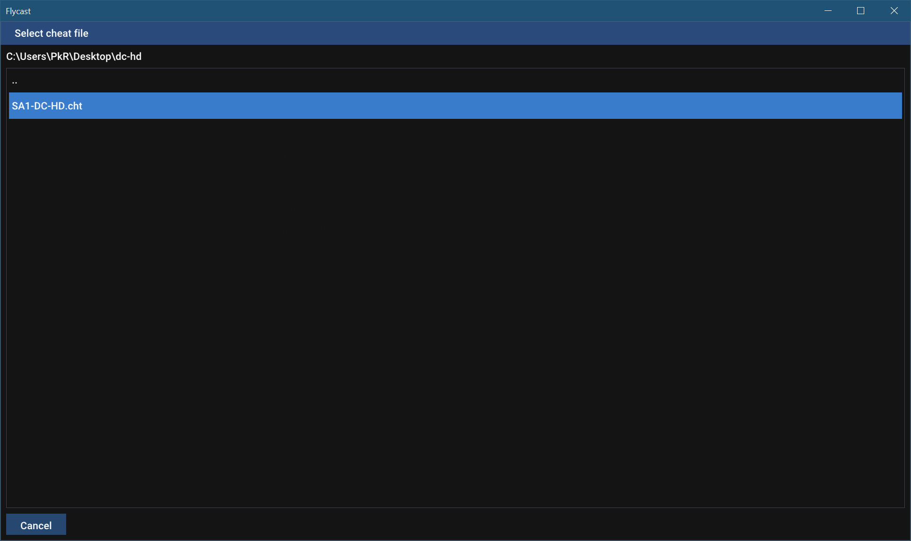
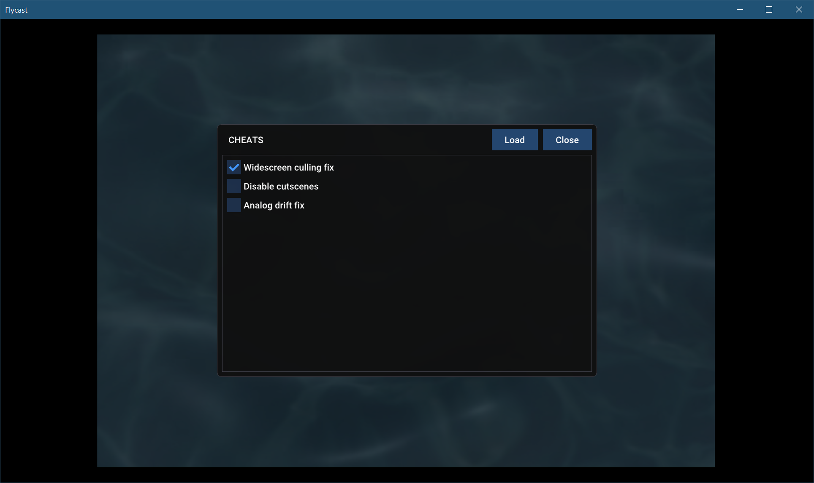
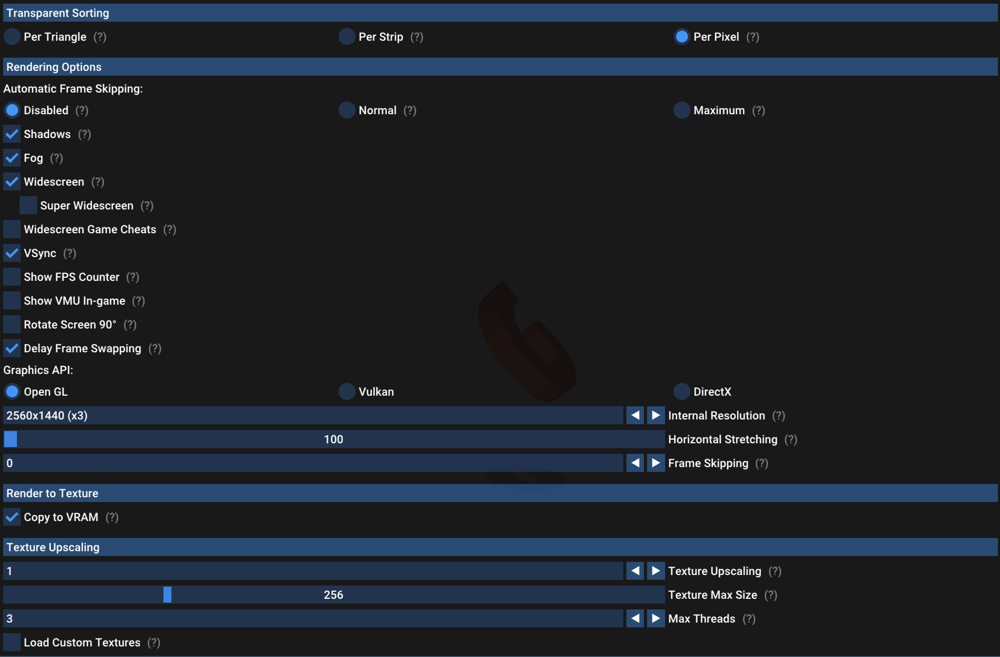

# Sonic Adventure DC-HD

Version 31/08/2021

This repository hosts a program that applies a set of patches to the Dreamcast version of Sonic Adventure to introduce various fixes and improvements.

The patched version is meant to be run on the [flycast emulator](https://flyinghead.github.io/flycast-builds), although everything other than 60 FPS and widescreen hacks will also work on other emulators and original Dreamcast hardware.

**LIST OF PATCHES**

- The game runs at 60 FPS during gameplay without framerate-related glitches (hopefully).
- Widescreen hack without model clipping or HUD stretching.
- All FMVs can be skipped by pressing Start.
- Cutscenes can be skipped by holding B before a cutscene loads.
- If you cannot run in a straight line with your controller/keyboard, there is a patch to fix that.
- Less choppy ocean in Emerald Coast (similar to Dreamcast Conversion for SADX PC).
- Some levels have better level draw distance.

All patches are optional and can be toggled individually before building the image.

**PREREQUISITES**

- Sonic Adventure US 1.005 GDI image.
- [flycast](https://flyinghead.github.io/flycast-builds/) or reicast to play the game.

**As of August 2021, only flycast is compatible with the 60 FPS code and the current implementation of the widescreen hack.**

**HOW TO USE**
1. Download the latest [release](https://github.com/PiKeyAr/sa1-dc-hd/releases) and extract it somewhere.
2. Run `Patcher.exe`.
3. In the first tab, select the folder containing your SA1 GDI file. If the SA1 image is the correct version, two other tabs will appear.

4. In the second tab, select the patches you would like to apply.

5. In the third tab, select the output path for the patched image and click Build. Wait for the process to finish.

6. Run flycast and select the patched image.
7. Load the cheat file called `SA1-DC-HD.cht` located in the same folder as the patched image.

8. If you are using the widescreen hack, make sure the culling fix is enabled in the cheats menu.

**CONFIGURING FLYCAST**
Video tab:

**CREDITS**

- [Exant](https://github.com/Exant64) for work on the hardest parts related to widescreen and skippable cutscenes, as well as general help

This patcher uses the following tools/libraries:
- bin2iso and extract from FamilyGuy's GDI2Data https://dcemulation.org/dumpcast/viewtopic.php?t=785
- buildgdi from Sappharad's GDIbuilder https://github.com/Sappharad/GDIbuilder
- Sewer56's dlang-prs https://github.com/Sewer56/dlang-prs
- ini-parser https://github.com/rickyah/ini-parser
